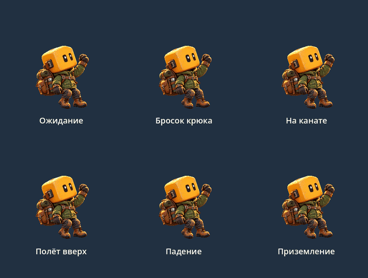
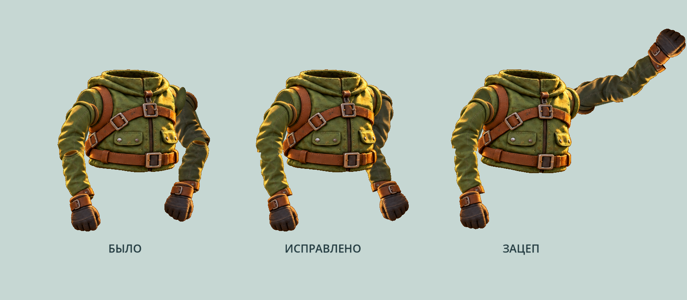
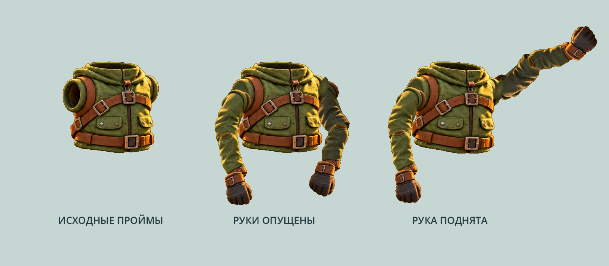
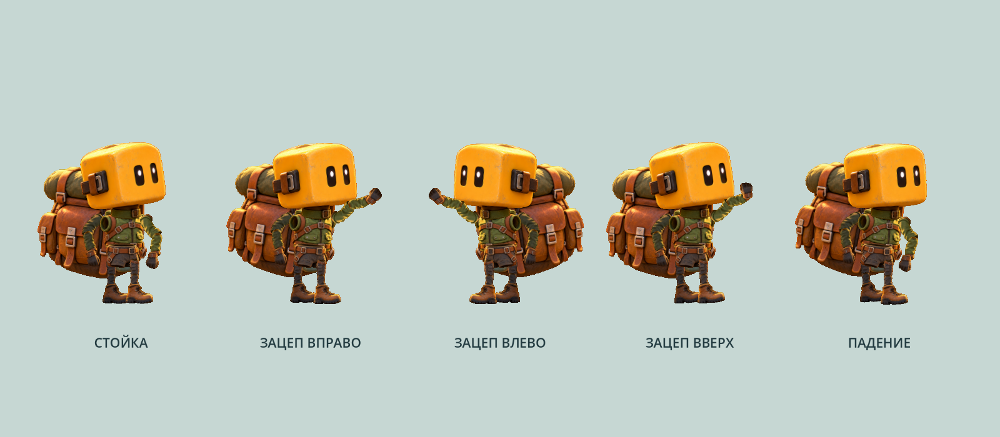
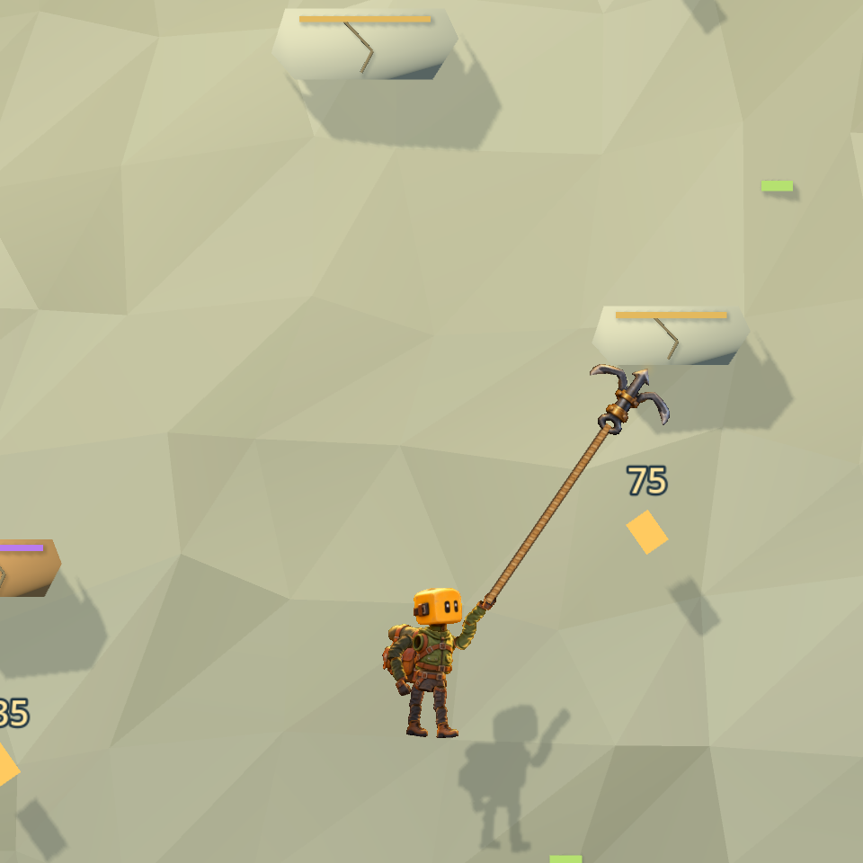
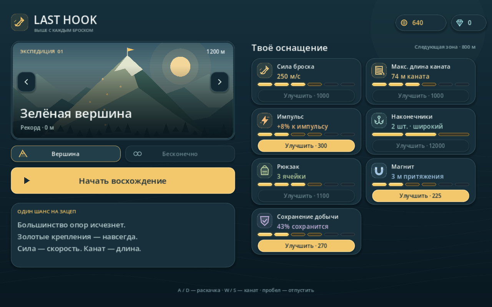

# Last Hook

Игра для Android и Windows на Godot 4.7.2. Цепляйся крюком, раскачивайся и перелетай между опорами. Большинство опор исчезает после отцепления; проигрыш наступает, когда герой полностью падает ниже экрана.

Текущая версия: **0.10.6**.

## Играть

Готовые Windows и Android сборки находятся в разделе [Releases](https://github.com/DrShapaya/last-hook/releases) репозитория.

- Windows: распаковать архив и запустить `LastHook.exe`.
- Android: установить `LastHook-debug.apk` на устройство ARM64. Это тестовая сборка, не Google Play.
- Из исходников: открыть `game/project.godot` в Godot 4.7.2 и нажать F6/F5.
- Локально в подготовленном проекте: `Play.cmd`.

Сохранения готового EXE хранятся в пользовательской папке Godot. `Play.cmd` использует локальную папку `UserData/`. Сохранения и резервные копии в Git не попадают.

## Управление

| Windows | Действие |
|---|---|
| Зажать ЛКМ, прицелиться, отпустить | Бросить крюк |
| A / D | Раскачиваться |
| W / S или колесо | Сокращать / удлинять канат |
| Пробел | Отцепиться |
| Удержать ячейку рюкзака | Выбросить предмет |

На телефоне первый палец отвечает за прицел и раскачку. Второй палец: движение вверх/вниз меняет канат, короткий тап отпускает его.

## Что изменилось в 0.10.6

- Новый цельный персонаж из одного PNG: большая голова, компактное тело, непрерывный рисунок одежды и конечностей.
- Шесть состояний: ожидание, бросок крюка, раскачивание, полёт вверх, падение и приземление. Поза, наклон и разворот плавно переходят между состояниями; рюкзак слегка отстаёт от движения тела.
- Непрерывная анимация поверхности сохраняет соединения частей рисунка. Канат следует за изображённой кистью. Пауза останавливает анимацию.
- **PreviewAnimations.cmd** открывает все шесть анимаций одновременно. **PreviewSource.cmd** запускает игру из исходников.



## Что изменилось в 0.10.5

- Исправлен сгиб заднего локтя; детали рукава и перчатка развёрнуты для задней руки.
- Заднее плечо остаётся за торсом. Открытые торцы деталей скрыты в стыках локтей.



## Что изменилось в 0.10.4

- Исправлены стороны рук для ракурса торса: видимая пройма слева принадлежит ближней руке.
- Плечи совмещены с центрами нарисованных отверстий; ткань плеча закрывает полость проймы при движении.



## Что изменилось в 0.10.3

- Плечи и бёдра привязаны к точкам на рисунках куртки и шорт с перекрытием внутри корпуса.
- Верх рукавов и штанин заведён под одежду; скрытая основа закрывает просветы между деталями конечностей.

## Что изменилось в 0.10.2

- Исправлены точки вращения деталей: плечи, локти, кисти и колени соединяются без смещения.
- Корпус и ботинки получили больше объёма, убран чрезмерный наклон; большая голова и компактный силуэт сохранены.



## Что изменилось в 0.10.1

- Компактный персонаж с большой головой, маленьким телом и короткими конечностями, ростом примерно с рюкзак.
- Наконечник крюка вдвое меньше; канат соединён с его кольцом.

## Что изменилось в 0.10

- Игрок собран из рисованных деталей: зелёная куртка, жёлтая голова, кожаный рюкзак, перчатки и ботинки.
- Плечи, локти, бёдра и колени двигаются; персонаж разворачивается, тянется к крюку и моргает.
- Канат стал объёмным и плетёным. Текстура повторяется по длине; провисание сохраняется.
- Новый металлический крюк использует исходный рисунок с латунными креплениями. Видно именно купленное количество наконечников: 1, 2 или 3.
- Канат соединяется с кистью и кольцом крюка. Сохранения, физика и цены не изменены.



## Что изменилось в 0.9

- Мир и фон заполняют окно без чёрных полос. Интерфейс учитывает пропорции экрана; широкое лобби использует две колонки.
- На конце каната виден металлический крюк и при полёте, и после зацепа.
- Вместо «Захвата» — **1 → 2 → 3 наконечника** на одном крюке. Больше наконечников расширяет допуск попадания. Второй стоит 2 400 золота, третий ещё 12 000.
- Лёд и кристалл доступны базовому крюку. Старые покупки «Захвата» перенесены в наконечники; остальные улучшения и активная попытка сохраняются.
- Сила броска определяет скорость крюка, длина каната — досягаемость. Это отдельные улучшения.



## Собрать персонажа вручную

Старая составная модель сохранена в `game/scenes/player.tscn`; **EditCharacter.cmd** открывает её для редактирования. Текущая игра использует цельный рисунок через `player_sprite.tscn`. Правки старой составной модели не влияют на текущего персонажа.

Пошаговая инструкция и названия деталей: [docs/CHARACTER_EDITING.md](docs/CHARACTER_EDITING.md).

## Разработка и проверки

В `game/` находятся проект, исходники, ресурсы и проверки. Числа баланса — в `game/data/balance.json`. Дизайн и ограничения описаны в [00_README.md](00_README.md) и [07_prototype_status.md](07_prototype_status.md).

Для автоматической сборки поместить портативный Godot 4.7.2 Windows с консольной версией и установленными шаблонами экспорта в `tools/godot/`. Для Android нужны Java 21, Android SDK и отладочный ключ в настройках редактора. Движок, SDK, ключи и результаты сборки не включены в репозиторий.

```powershell
./tools/build.ps1 -Target All -AndroidSdkPath 'C:\Android\Sdk' -JavaSdkPath 'C:\Java\jdk-21'
```

Скрипт запускает проверки правил, интеграции, генерации, адаптивного интерфейса, сохранения старой ручной сборки и плавности анимации цельного спрайта; затем собирает EXE/APK и проверяет подпись APK. Проверки используют отдельные профили в `artifacts/`.

Для запуска проверок вручную задать `LASTHOOK_SAVE_DIR` в отдельную временную папку, импортировать проект в Godot, затем выполнить нужный `game/tests/test_*.gd` через `--headless --script`.

Баланс требует ручных игровых сессий. Проверки ботом не подтверждают сложность и удобство для человека. Физические Android-устройства и вырезы экранов ещё не проверены. Рекламных и платёжных SDK нет.
